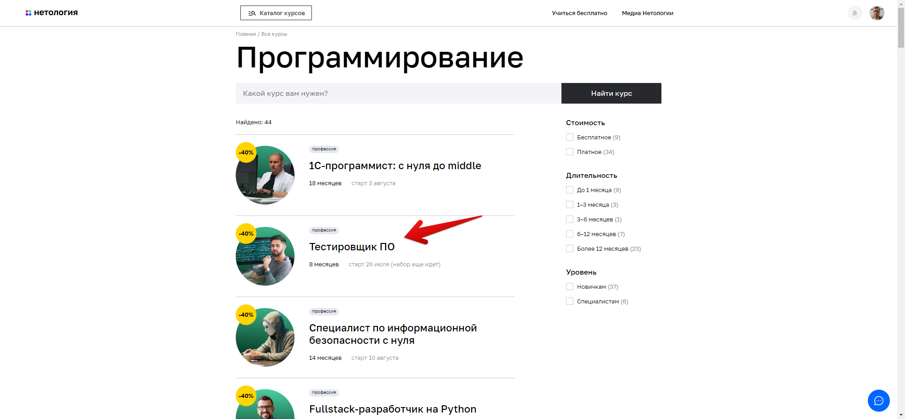
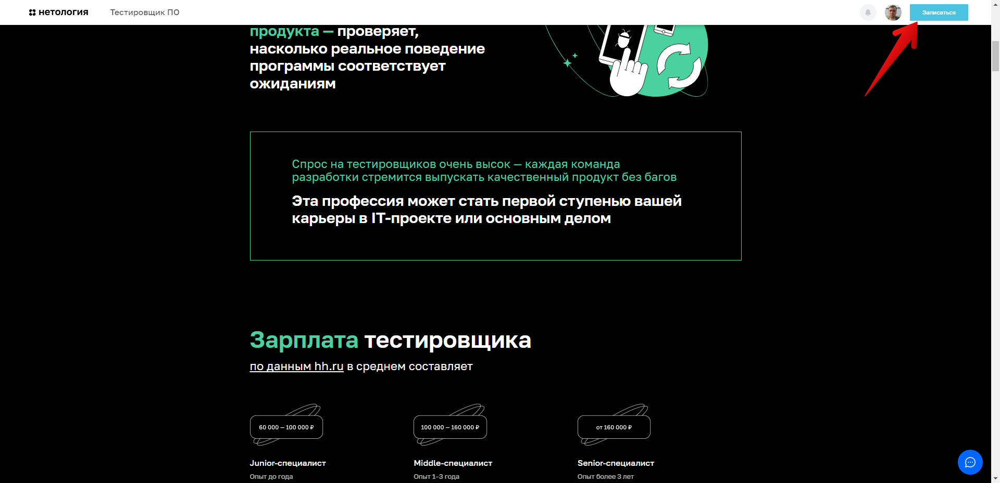

# План автоматизации тестирования возможности записи на обучение профессии "Тестировщик ПО"

## Перечень автоматизируемых сценариев:

### Сценарии перехода с главной страницы сайта https://netology.ru на страницу профессии «Тестировщик ПО»:

#### Предусловие выполнения сценария:
Ввод адреса страницы  https://netology.ru в адресную строку браузера;
Переход по ссылке на сайт Нетологии.

**Сценарий №1:**
1. Нажать кнопку "Каталог курсов";
2. Нажать в появившемся всплывающем окне "Программирование" (рис. 1);

Рисунок 1

3. Прокрутить страницу до курса "Тестировщик ПО";
4. Кликнуть по карточке "Тестировщик ПО" (рис 1.1).
   
   Рисунок 1.1

**Сценарий №2:**
1. Нажать кнопку "Каталог курсов";
2. В поисковой строке ввести "тестировщик";
3. В появившемся всплывающем окне выбрать "Тестировщик ПО" (рис. 2).

Рисунок 2

**Сценарий №3:**
1. Нажать кнопку "Каталог курсов";
2. В поисковой строке  набрать "тестировщик";
3. Нажать кнопку "Найти курс";
4. Прокрутить страницу до карточки "Тестировщик ПО";
5. Кликнуть по карточке  "Тестировщик ПО" (рис. 3).

Рисунок 3

**Сценарий №4:**
1. Прокрутить главную страницу к разделу (заголовку) "Направления обучения";
2. Выбрать карточку "Программирование" (см. рис.4);
   
   Рисунок 4
3. Прокрутить страницу, до  карточки "Тестировщик ПО";
4. Кликнуть по карточке  "Тестировщик ПО" (см. рис.4.1).
   
   Рисунок 4.1

**Сценарий №5:**
1. Прокрутить главную страницу к разделу (заголовку) "Направления обучения";
2. Кликнуть по карточке "Программирование" (см. рис.4);
3. В поисковой строке ввести "тестировщик";
4. В появившемся всплывающем окне выбрать "Тестировщик ПО" (см. рис.2).

**Сценарий №6:**
1. Прокрутить главную страницу к разделу "Направления обучения";
2. Выбрать карточку "Программирование" (см. рис.4);
3. В поисковой строке ввести "тестировщик";
4. Нажать кнопку "Найти курс";
5. Прокрутить страницу до карточки "Тестировщик ПО";
6. Кликнуть по карточке  "Тестировщик ПО" (см. рис.3).

**Сценарий №7:**
1. Прокрутить главную страницу к разделу "Направления обучения";
2. Нажать кнопку "Полный каталог" (см. рис.5);
   
   Рисунок 5
3. Прокрутить страницу, до карточки "Тестировщик ПО";
4. Кликнуть по карточке "Тестировщик ПО" (см. рис.3).

**Сценарий №8:**
1. Прокрутить главную страницу к разделу "Направления обучения";
2. Нажать кнопку "Полный каталог" (см. рис.5);
3. В поисковой строке ввести "тестировщик";
4. В появившемся всплывающем окне выбрать "Тестировщик ПО" (см. рис. 2).

**Сценарий №9:**
1. Прокрутить главную страницу к разделу "Направления обучения";
2. Нажать кнопку "Полный каталог" (см. рис.5);
3. В поисковой строке ввести "тестировщик";
4. Нажать кнопку "Найти курс";
5. Прокрутить страницу до карточки "Тестировщик ПО";
6. Кликнуть по карточке  "Тестировщик ПО" (см. рис. 3);

**Сценарий №10:**
1. Прокрутить главную страницу к разделу "Направления обучения";
2. Нажать кнопку "Полный каталог" (см. рис.5);
3. Нажать  кнопку "Программирование" (см. рис. 6);
   
   Рисунок 6

4. Прокрутить страницу до карточки "Тестировщик ПО";
5. Кликнуть по карточке "Тестировщик ПО" (см. рис. 3);

**Сценарий №11:**
1. Прокрутить главную страницу до "подвала";
2. В разделе "Обучение" нажать ссылку "Каталог курсов" (см. рис. 7);
   
   Рисунок 7
3. Прокрутить страницу до карточки "Тестировщик ПО";
4. Кликнуть по карточке  "Тестировщик ПО" (см. рис. 3).

**Сценарий №12:**
1. Прокрутить главную страницу до "подвала";
2. В разделе "Обучение" нажать ссылку "Каталог курсов" (см. рис. 7);
3. В поисковой строке ввести "тестировщик";
4. Появившемся всплывающем окне выбрать "Тестировщик ПО" (см. рис. 2).

**Сценарий №13:**
1. Прокрутить главную страницу до "подвала";
2. В разделе "Обучение" нажать ссылку "Программирование" (см. рис. 8);
   
   Рисунок 8
3. Прокрутить страницу до карточки "Тестировщик ПО";
4. Кликнуть по карточке  "Тестировщик ПО" (см. рис. 3).

**Сценарий №14:**
1. Прокрутить главную страницу до "подвала";
2. В разделе "Обучение" нажать ссылку "Программирование" (см. рис. 8);
3. В поисковой строке ввести "тестировщик";
4. В появившемся всплывающем окне выбрать "Тестировщик ПО" (см. рис. 2).

#### Общий итог всех сценариев: открылась страница курса "Тестировщик".

### Сценарии перехода на странице курса "Тестировщик ПО" к форме регистрации на курс:

#### Предусловие выполнения сценария:
Открыта страница курса "Тестировщик ПО"

**Сценарий №1:**
- Нажать кнопку "Записаться".
- 
  Рисунок 9

**Сценарий №2:**
- Прокрутить страницу с курсом "Тестировщик ПО" вниз
- В появившемся "pop-up" окне нажать кнопку "Записаться".
- 
  Рисунок 9

##### Общий итог всех сценариев №1 и №2: прокрутка страницы к форме записи на курс.

**Сценарий №3:**
- Прокрутить страницу вниз до формы "Запишитесь на курс".

### Сценарии заполнения и отправки формы регистрации на курс:

#### Заполнение анкеты неавторизованным пользователем:

##### Сценарий Happy Path:
1. Заполнить поле "Имя" буквами на кириллице или латинице
   не менее чем из двух букв;
2. Заполнить поле "Номер телефона" по шаблону:
   - Одиннадцать цифр;
   - Форма ввода: +7 (999) 999-99-99;
3. Заполнить поле "Электронная почта" корректным e-mail:
   - Не должен содержать русских букв;
   - Должен содержать знак «собака» (@);
   - Должен содержать точку (.)
   - Валидное наименование почтового домена (например: mail.ru, yandex.ru, gmail.com и т.д.)
4. Кликнуть по кнопке "Записаться" - произойдет переход к экранной форме записи.
##### Ожидаемый результат: появится сообщение об успешной записи.

##### Сценарий Sad Path:
**Сценарий №1:**
1. Заполнить поле "Имя" одной буквой;
2. Заполнить поле "Номер телефона" валидным значением;
3. Заполнить поле "Электронная почта" валидным значением;
4. Кликнуть по кнопке "Записаться".
##### Ожидаемый результат: сообщение "Имя должно содержать более 2 символов".

**Сценарий №2:**
1. Заполнить поле "Имя" цифрами;
2. Заполнить поле "Номер телефона" валидным значением;
3. Заполнить поле "Электронная почта" валидным значением;
4. Кликнуть по кнопке "Записаться".
##### Ожидаемый результат: сообщение "Имя должно состоять из букв".

**Сценарий №3:**
1. Заполнить поле "Имя" спецсимволами (например, $%*);
2. Заполнить поле "Номер телефона" валидным значением;
3. Заполнить поле "Электронная почта" валидным значением;
4. Кликнуть по кнопке "Записаться".
##### Ожидаемый результат: сообщение "Имя должно состоять из букв".

**Сценарий №4:**
1. Заполнить поле "Имя" валидным значением;
2. Заполнить поле "Номер телефона" не по шаблону "буквами";
3. Заполнить поле "Электронная почта" валидным значением;
4. Кликнуть по кнопке "Записаться".
##### Ожидаемый результат: сообщение "Номер телефона должен быть в формате +9 (999) 999-99-99".

*Сценарий №4:**
1. Заполнить поле "Имя" валидным значением;
2. Заполнить поле "Номер телефона" числами, количество которых менее 11;
3. Заполнить поле "Электронная почта" валидным значением;
4. Кликнуть по кнопке "Записаться".
##### Ожидаемый результат: сообщение "Номер телефона должен быть в формате +9 (999) 999-99-99".

**Сценарий №5:**
1. Заполнить поле "Имя" валидным значением;
2. Заполнить поле "Номер телефона" числами, количество которых превышает 11;
3. Заполнить поле "Электронная почта" валидным значением;
4. Кликнуть по кнопке "Записаться".
##### Ожидаемый результат: Поле не позволяет ввести более 11 чисел.

**Сценарий №6:**
1. Заполнить поле "Имя" валидным значением;
2. Заполнить поле "Номер телефона" валидным значением;
3. Заполнить поле "Электронная почта" русскими буквами;
   без знака «собака» (@)
   без точки (.)
4. Кликнуть по кнопке "Записаться".
##### Ожидаемый результат: сообщение "Неверный email".

**Сценарий №7:**
1. Заполнить поле "Имя" валидным значением;
2. Заполнить поле "Номер телефона" валидным значением;
3. Заполнить поле "Электронная почта" без знака «собака» (@);
   без точки (.)
4. Кликнуть по кнопке "Записаться".
##### Ожидаемый результат: сообщение "Неверный email".

**Сценарий №8:**
1. Заполнить поле "Имя" валидным значением;
2. Заполнить поле "Номер телефона" валидным значением;
3. Заполнить поле "Электронная почта" без точки (.);
4. Кликнуть по кнопке "Записаться".
##### Ожидаемый результат: сообщение "Неверный email".
#### Общий ожидаемый результат для сценариев Sad Path: запись на курс не осуществляется.

##### Сценарий Empty Path:

**Сценарий №1:**
1. Не заполнять поле "Имя"
2. Заполнить поле "Номер телефона" валидным значением;
3. Заполнить поле "Электронная почта" валидным значением;
4. Кликнуть по кнопке "Записаться".
##### Ожидаемый результат: сообщение "Обязательное поле для заполнения".

**Сценарий №2:**
1. Заполнить поле "Имя" валидным значением;
2. Не заполнять поле "Номер телефона";
3. Заполнить поле "Электронная почта" валидным значением;
4. Кликнуть по кнопке "Записаться"
##### Ожидаемый результат: сообщение "Обязательное поле для заполнения".

**Сценарий №3:**
1. Заполнить поле "Имя" валидным значением;
2. Заполнить поле "Номер телефона" валидным значением;
3. Не заполнять поле "Электронная почта";
##### Ожидаемый результат: сообщение "Обязательное поле для заполнения".
#### Общий ожидаемый результат для сценариев Empty Path: запись на курс не осуществляется.

#### Заполнение анкеты авторизованным пользователем

##### Сценарий Authorized User:
1. В форме авторизации нажать кнопку "Войти";
2. Авторизоваться с данными зарегистрированного пользователя;
3. Поле "Имя" и "Номер телефона" заполнены теми данными, которые указывались при регистрации
4. Поле "Электронная почта" отсутствует;
5. Кликнуть по кнопке "Записаться".
#### Ожидаемый результат для сценария Authorized User: успешная запись на курс.

## Перечень используемых инструментов с обоснованием выбора:
- _IntelliJ IDEA 2022.2 (Ultimate Edition)_ - среда разработки, мощная и удобная, поддержка многих языков программирования, в частности Java, JavaScript, Python,с поддержкой всех последних технологий и фреймворков.
- _Java 11_ язык для написания автотестов, имеет набор готового ПО для разработки и запуска приложений.
- _Gradle_ понадобится для сборки проекта, для управления подключенными зависимостями, а так же для генерации отчётов о тестировании. Он прост в использовании благодаря тому, что билд скрипты короче и чище чем у Ant и Maven.
- _JUnit 5_ необходим для написания и запуска тестов. Не требует контроля пользователя во время исполнения тестов, может запускать одновременно несколько тестов, сообщает обо всех ошибках в ходе тестирования, предоставляет готовый набор методов для сравнения ожидаемого и фактического результатов.
- _Docker_ — это программное обеспечение, которое дает возможность на определенном участке памяти изолированно установить необходимую ОС (операционную систему), версию Java, настроить переменные окружения, установить различные зависимости и дать доступ только при определенных условиях.
- _Selenide_ фреймворк,необходимый, для тестирования GUI. Помогает делать стабильные тесты, решая почти все проблемы с таймаутами, автоматически управляет браузером и делает скриншоты если тест упал.
- _Lombok_ - основанная на аннотациях библиотека Java, позволяющая сократить шаблонный код, уменьшает трудозатраты и время на разработку и обеспечивает некоторую дополнительную функциональность.
- _Faker_- библиотека, необходимая для генерации тестовых данных.
- _Rest Assured_ - java-библиотека для тестирования REST API, позволяет автоматизировать тестирование get и post запросов.
- _Allure_ - фреймворк для создания отчетов о тестировании,  наглядного отображения прохождения тестов и ошибок. Обладает более широким представление отчетов об проводимых тестах, чем Gradle.
- _Git и GitHub_ для ведения репозитория по проектам. Git достаточно прост и удобен для управления исходным кодом, очень распространенная система контроля версий, поэтому достаточно хорошо взаимодействует с различными ОС. GitHub специализированный веб-сервис с удобным интерфейсом, интегрирован с Git.
- _AppVeyor_ - распределённый веб-сервис непрерывной интеграции, предназначенный для сборки и тестирования программного обеспечения расположенного на GitHub и других сервисах хранения исходного кода (включая GitLab и Bitbucket), использующий виртуальные машины Microsoft Windows и Ubuntu. Этот сервис удобен тем что он имеет бесплатный базовый тариф, может осуществлять сборку как под управлением Linux, так и под Windows, а если необходимо то под несколькими сразу.

## Перечень необходимых разрешений/данных/доступов:
- Если проект реализует не сама Нетология, то необходимо письменное разрешение на проведение тестирования от владельца веб-сайта Нетологии.;
- Нужен доступ к БД для проверки результатов выполнения тестов;
- Техническая документация, для понимания валидных и невалидных данных и др. требований.
- API для отправки GET и POST запросов на сервер.

## Перечень и описание возможных рисков при автоматизации:
- Отсутствие технической документации.
- Не значительное изменение реализации веб-элементов на странице, могут привести к падению ранее написанных авто-тестов.
- Авто-тесты не проверяют графический интерфейс (GUI) сайта;
- Возможно появление "Ненужных данных" (остатки после тестирования) в базе данных;
- Ложные срабатывания по отправке форм, что в свою очередь может увеличить нагрузку по обработке данных.

## Перечень необходимых специалистов для автоматизации
- инженер по автоматизации тестирования

## Интервальная оценка с учётом рисков в часах
Ориентировочное время реализации: зависит от квалификации инженера по автоматизации тестирования от 16 до 32 чел.час.

